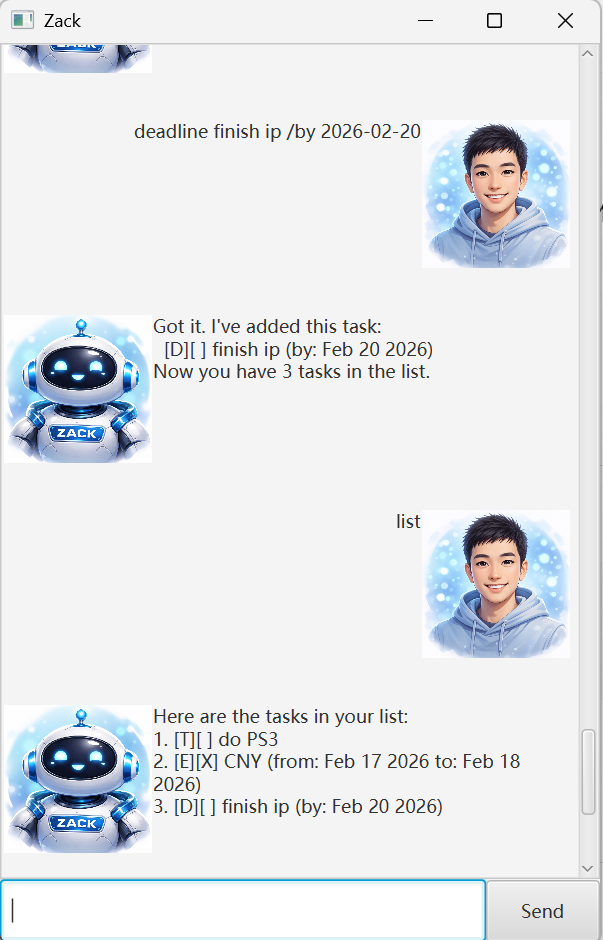

# Zack User Guide



Zack is a lightweight task management chatbot designed for fast, keyboard-driven task tracking.
It allows you to create, manage, and organize tasks such as todos, deadlines, and events through simple commands.


## Adding Tasks

### Adding Todos: todo

Adds simple tasks without any date.

**Format:** `todo DESCRIPTION`

Example: `todo prepare for the midterm`

Expected output:

```
Got it. I've added this task:
 [T][ ] prepare for the midterm
Now you have 1 tasks in the list.
```

### Adding Deadlines: deadline

Adds tasks with a due date.

**Format:** `deadline DESCRIPTION /by DATE`

**Date Format:** `yyyy-MM-dd`(e.g. 2026-02-20)

Example: `deadline finish ip /by 2026-02-20`

Expected output:

```
Got it. I've added this task:
 [D][ ] finish ip (by: Feb 20 2026)
Now you have 2 tasks in the list.
```

### Adding Events: event

Adds tasks with a start date and end date.

**Format:** `event DESCRIPTION /from DATE to DATE`

**Date Format:** `yyyy-MM-dd`(e.g. 2026-02-20)

Example: `event celebrate CNY /from 2026-02-17 /to 2026-02-18`

Expected output:

```
Got it. I've added this task:
 [E][ ] celebrate CNY (from: Feb 17 2026 to Feb 18 2026)
Now you have 3 tasks in the list.
```

## Viewing Tasks

### Listing all tasks: list

Shows a list of all tasks. 
**Format:** `list`

Example: `list`

Expected output:

```
Here are the tasks in your list:
1.[T][ ] prepare for the midterm
2.[D][ ] finish ip (by: Feb 20 2026)
3.[E][ ] celebrate CNY (from: Feb 17 2026 to Feb 18 2026)
```

## Managing Tasks

### Marking Tasks: mark

Marks task as done

**Format:** `mark INDEX`

Example: `mark 3`

Expected output:

```
Nice! I've marked this task as done:
 [E][X] celebrate CNY (from: Feb 17 2026 to Feb 18 2026)
```

### Unmarking Tasks: unmark

Unmarks task as not done

**Format:** `unmark INDEX`

Example: `unmark 3`

Expected output:

```
OK, I've marked this task as not done yet:
 [E][ ] celebrate CNY (from: Feb 17 2026 to Feb 18 2026)
```

### Deleting Tasks: delete

Deletes task from your list

**Format:** `delete INDEX`

Example: `delete 1`

Expected output:

```
Noted. I've removed this task:
 [T][ ] prepare for the midterm
Now you have 2 tasks in the list.
```

### Finding Tasks: find

Search for tasks containing a specific keyword.

**Format:** `find KEYWORD`

Example: `find ip`

Expected output:

```
Here are the matching tasks in your list:
1.[D][ ] finish ip (by: Feb 20 2026)
```

### Sort Tasks: sort

Sort the deadline/event with their due date/end date.

**Format:** `sort`

Expected output:

```
Tasks sorted by date:
1.[E][ ] celebrate CNY (from: Feb 17 2026 to Feb 18 2026)
2.[D][ ] finish ip (by: Feb 20 2026)
```

## Exiting: bye

Close the application

**Format:** `bye`

Expected output:

```
Bye! Hope to see you again soon.
```
The application will automatically close after a while.